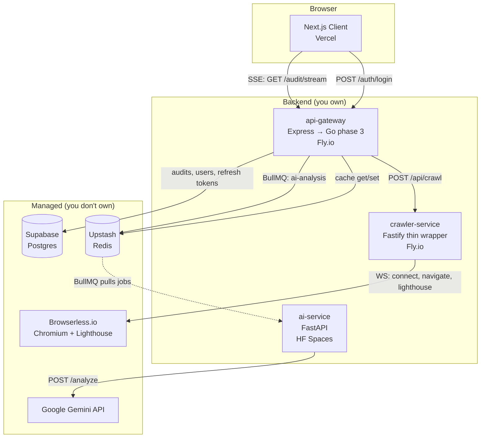

# 02 — Architecture

Event-driven microservices. One frontend, three backend services, four managed infra dependencies.

## Service map

## Service responsibilities

### Client (Next.js, Vercel)

- Landing pages, auth UI, audit input form
- Opens SSE to gateway
- Renders skeletons → metrics → AI insights as events arrive
- Local cache (24h, dual-key by URL + sanitized URL)
- Owns: nothing persistent. Everything user-visible comes from the gateway.

### api-gateway (Express today; Go phase 3)

- **Single front door** — only backend service exposed to the public internet
- Auth (DIY JWT, phase 1 login-only, phase 2 refresh tokens)
- URL sanitization + SSRF validation (DNS resolve + private-IP block + scheme allowlist)
- Cache lookup (Redis hot, Postgres cold)
- Orchestration: dispatch crawler call, queue AI job, stream results back via SSE
- Rate limiting (anonymous: 1 lifetime by IP; authenticated: 3/month by userId)
- Owns: the SSE protocol, the audit lifecycle, the user/audit/refresh-token Postgres tables.

### crawler-service (Fastify, thin wrapper after phase 1)

- Wraps Browserless.io WebSocket protocol
- Extracts metadata (cheerio) + readability stats from Browserless-rendered HTML
- Dispatches Lighthouse via Browserless's built-in lighthouse function (not local subprocess after migration)
- Validates URLs at the boundary (defense in depth — gateway also validates)
- Owns: nothing. Stateless.

### ai-service (Python FastAPI)

- Single endpoint: `POST /analyze` (page_content + metadata + lighthouse_metrics → AIResponse)
- LangChain pipeline: prompt template → Gemini → JSON parser (`json-repair` lib)
- Internal HMAC-signed-request validation (only gateway/worker can call it)
- Owns: nothing. Stateless. All quota state lives in the gateway / Redis.

## Data flow (cold cache, narrative)

1. Client → `EventSource` → `GET /api/audit/stream` (with `sse_token` from prior `POST /audit/start`)
2. Gateway validates token + sanitizes URL + checks SSRF rules
3. Gateway checks Redis (`audit:<sanitized_url>`) → MISS
4. Gateway checks Postgres `audits` table → MISS
5. Gateway emits `status: "Starting crawler"`
6. Gateway → `POST /api/crawl` to crawler-service
7. Crawler → Browserless: navigate, get HTML, run Lighthouse
8. Crawler returns `CrawlResponse` (metadata + lighthouse + technical + readability)
9. Gateway emits `crawler` event with payload, `setLoading(false)` on client
10. Gateway computes `sha256(html)`, checks Postgres for prior AI analysis on same hash → MISS
11. Gateway enqueues BullMQ job on `ai-analysis` queue (Upstash Redis)
12. Gateway awaits `job.waitUntilFinished()` (timeout 60s)
13. ai-service worker pulls job, calls Gemini, returns AIResponse
14. Gateway emits `ai` event with payload
15. Gateway persists full audit row to Postgres
16. Gateway sets Redis cache (`audit:<sanitized_url>`, TTL 24h)
17. Gateway emits `complete` event, closes SSE
18. Client renders dashboard, caches in localStorage

For partial-hit, error, and disconnect flows, see [04-low-level-flows.md](04-low-level-flows.md).

## Inter-service contracts

Defined in [`libs/shared/types/src/lib/crawler.interface.ts`](../libs/shared/types/src/lib/crawler.interface.ts):

- `CrawlResponse` — crawler → gateway
- `AiCrawlResponse` — extends `CrawlResponse` with `page_content` (gateway → ai-service via BullMQ payload)
- `AIAnalysis` — ai-service → gateway (in `AiAnalysisResponse`)
- Sub-types: `SeoMetadata`, `LighthouseMetrics`, `TechnicalAnalysis`, `ReadabilityStats`

Python ai-service has equivalent pydantic models in [`apps/ai-service/app/models/schemas.py`](../apps/ai-service/app/models/schemas.py). Keep them in sync; see [ADR 006](08-decisions.md#adr-006--technical_analysis-from-crawler-only-resolve-schema-drift) for the `technical_analysis` field resolution.

## Why microservices

Honest answer for the portfolio narrative:

- **Language fit** — Python is best for Gemini/LangChain; Node is best for Browserless SDK; Go is best for high-concurrency I/O (gateway). Forcing all into one runtime requires painful tradeoffs.
- **Independent scaling** — AI is the slowest component; queueing decouples its rate from the crawler's
- **Failure isolation** — AI down ≠ crawler down ≠ gateway down
- **Free-tier fit** — each service goes to the host that gives it the most headroom (HF Spaces for Python, Fly for Go, Browserless for Chromium)

## What we deliberately did _not_ do

- **Single backend monolith** (e.g., Express that calls Gemini directly) — too much logic in one process; AI cold starts would block HTTP requests
- **Serverless functions** for everything — Browserless + Lighthouse is too long-lived for Vercel/Cloudflare functions
- **Self-hosted Chromium** — Puppeteer's RAM footprint doesn't fit free-tier hosts (see [ADR 005](08-decisions.md#adr-005--browserlessio-for-puppeteer))
- **Centralized auth provider** (Clerk or similar managed identity service) — see [ADR 002](08-decisions.md#adr-002--diy-jwt-drop-managed-auth-provider)
