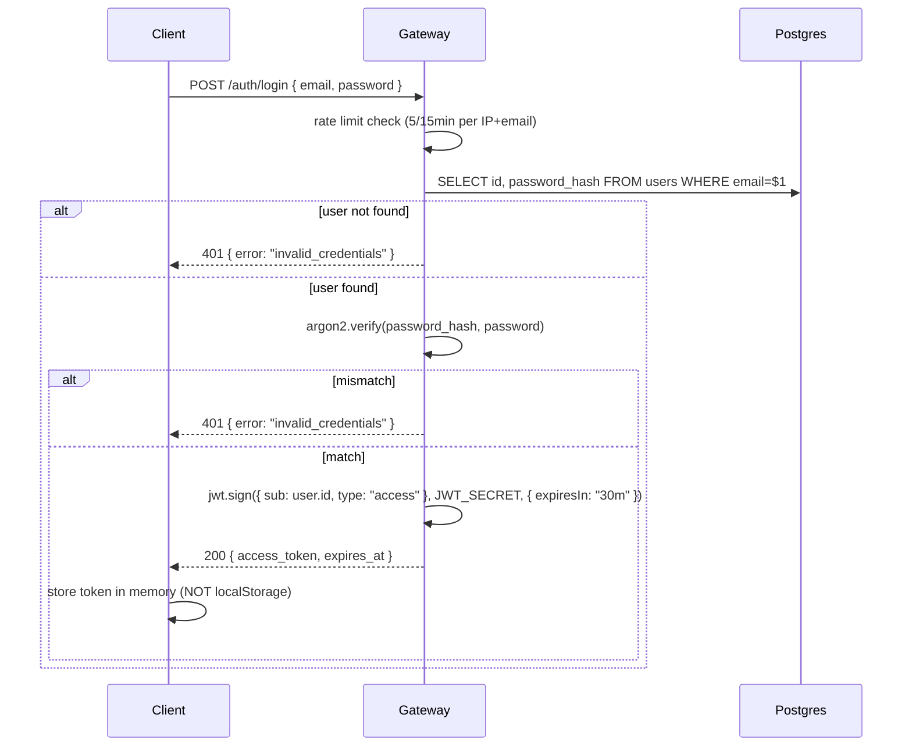

# 04 — Low-Level Flows

Sequence diagrams and step-by-step traces for every flow that matters.

## Audit — cold cache (full path)

```mermaid
sequenceDiagram
    participant U as User
    participant C as Client (Next.js)
    participant G as Gateway
    participant Cr as Crawler
    participant B as Browserless
    participant Q as Upstash (Redis+BullMQ)
    participant P as Postgres
    participant A as AI Service
    participant Gm as Gemini

    U->>C: paste URL, click Audit
    C->>G: POST /audit/start (Bearer JWT or anon)
    G->>P: check rate limit (auditUsage)
    G->>C: 201 { sse_token, expires_at }
    C->>G: GET /audit/stream?sse_token=...
    G->>G: validate sse_token (HMAC, IP, ttl, single-use)
    G->>G: sanitize URL + SSRF check
    G->>Q: GET audit:<sanitized_url>
    Q-->>G: nil
    G->>P: SELECT * FROM audits WHERE url=$1 ORDER BY created_at DESC LIMIT 1
    P-->>G: nil (or stale > 24h)
    G-->>C: event: status, data: "Starting crawler"
    G->>Cr: POST /api/crawl { url, requestId }
    Cr->>Cr: SSRF re-check
    Cr->>B: WS connect, navigate(url, {waitUntil: domcontentloaded})
    B-->>Cr: HTML
    Cr->>B: lighthouse(url)
    B-->>Cr: lighthouse report
    Cr->>Cr: extract metadata (cheerio), readability stats
    Cr-->>G: { metadata, lighthouse, technical, readability, page_content }
    G-->>C: event: crawler, data: <CrawlResponse>
    G->>G: contentHash = sha256(page_content)
    G->>P: SELECT ai_analysis FROM audits WHERE contentHash=$1 LIMIT 1
    alt prior AI for same hash exists
        P-->>G: { ai_analysis }
        G-->>C: event: ai, data: <AIResponse>
    else no prior AI
        P-->>G: nil
        G->>Q: queue.add('analyze', {...}, { jobId, attempts: 3 })
        Q->>A: worker pulls job
        A->>Gm: chain.invoke({ title, description, lighthouse, text_summary })
        Gm-->>A: raw JSON
        A->>A: clean+parse JSON (json-repair)
        A-->>Q: job result
        Q-->>G: job.waitUntilFinished resolves
        G-->>C: event: ai, data: <AIResponse>
    end
    G->>P: INSERT INTO audits (...full row...)
    G->>Q: SETEX audit:<sanitized_url> 86400 <full row JSON>
    G-->>C: event: complete, data: {}
    G->>G: res.end(); cleanup AbortController
    C->>C: localStorage.set(audit:<url> + audit:<sanitized_url>, ...)
```

**Total time (cold)**: ~25–60s. Crawler ~15–30s. AI ~5–15s. Everything else <1s combined.

## Audit — full cache hit (Postgres < 24h)

1–8 as above (sse_token issued + stream opened + sanitization + SSRF) 9. Gateway: Redis HIT → full audit JSON 10. Gateway emits `crawler` + `ai` + `complete` back-to-back 11. SSE closes

**Total time**: ~150ms.

## Audit — partial hit (crawler-fresh + AI-cached by contentHash)

1–11 (crawler runs) 12. contentHash matches a prior audit's hash → reuse `ai_analysis` from Postgres 13. Skip BullMQ; emit `ai` event immediately

**Total time**: crawler-bound (~15–30s). Saves a Gemini call.

## Audit — crawler succeeds, AI fails

1–12 (crawler succeeds, queued AI job) 13. BullMQ job exhausts retries (3 attempts) 14. `job.waitUntilFinished` rejects 15. Gateway emits `error` event with `code: ai_unavailable` 16. **Do NOT persist a synthetic AIResponse to Postgres** — leave the row absent for this contentHash so a retry can succeed later 17. Optionally cache in Redis with short TTL (5min) keyed `audit:partial:<sanitized_url>` so duplicate requests get the same partial result without re-running the crawler 18. Emit `complete`, close SSE 19. Client renders Lighthouse + metadata sections; shows "AI insights temporarily unavailable" UI

## Audit — client disconnects mid-stream

1. Client closes tab → `req.close` fires on gateway
2. Gateway calls `abortController.abort()` (Express phase 1) or `cancel()` on context (Go phase 3)
3. AbortController propagates: in-flight axios call to crawler aborts; if BullMQ job already queued, it continues running (worker has no way to know caller left — acceptable, work isn't wasted because the result still caches)
4. Gateway clears keepalive interval and timeout
5. Gateway calls `res.end()` (no error event — client is gone)
6. No DB write (audit was incomplete)

## Login (phase 1)



Note: error message is identical for "user not found" and "wrong password" (don't leak which emails are registered).

## Token refresh (phase 2)

```mermaid
sequenceDiagram
    participant C as Client (interceptor)
    participant G as Gateway
    participant P as Postgres

    C->>G: GET /any-protected-endpoint (Authorization: Bearer <stale-access>)
    G-->>C: 401 { error: "token_expired" }
    C->>G: POST /auth/refresh (Cookie: refresh=<token>)
    G->>G: parse cookie, hash, lookup
    G->>P: SELECT * FROM refresh_tokens WHERE token_hash=$1 AND revoked_at IS NULL AND expires_at > NOW()
    alt invalid or revoked
        G-->>C: 401 + clear-cookie
        C->>C: redirect to /login
    else valid
        G->>G: rotate: generate new refresh token; mark old as replaced_by new.id
        G->>P: INSERT new refresh_token; UPDATE old SET replaced_by, revoked_at
        G->>G: jwt.sign new access token (15min)
        G-->>C: 200 { access_token } + Set-Cookie: refresh=<new>; HttpOnly; Secure; SameSite=Strict
        C->>G: retry original request with new access token
    end
```

## Signup (phase 2)

1. `POST /auth/signup { email, password }` (rate-limited 3/hour per IP)
2. Validate email format; check password length ≥ 12
3. Check email uniqueness (SELECT … LIMIT 1; lowercased)
4. argon2id hash password
5. INSERT user
6. Issue access + refresh tokens (or send verification email in v3 first)
7. Return same shape as login

## Error flows

### Crawler down

- Gateway → axios POST fails (ECONNREFUSED or 5xx)
- Gateway emits `error` event `{ code: "crawler_unavailable" }`
- No cache write
- Client shows retry button

### Browserless quota exhausted

- Crawler → Browserless WS returns 402 / 429
- Crawler returns 503 to gateway with structured error
- Gateway emits `error` event `{ code: "browserless_quota" }`
- Operator alert via Sentry (high severity)

### Postgres down

- Gateway → drizzle throws on every query
- Gateway emits `error` event `{ code: "internal" }` (don't reveal DB issue)
- Sentry captures full error
- HEAD probe still works if Redis is up — client gets 503

### Redis down

- Gateway: per-operation try/catch; degraded mode = skip cache, hit Postgres directly
- Audit still works, just slower
- Sentry alert at warn level
- (Replaces the v0 "sticky `isRedisAvailable` flag" anti-pattern)
